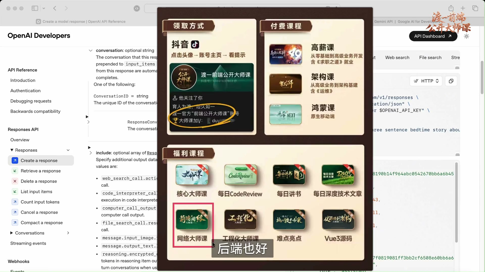
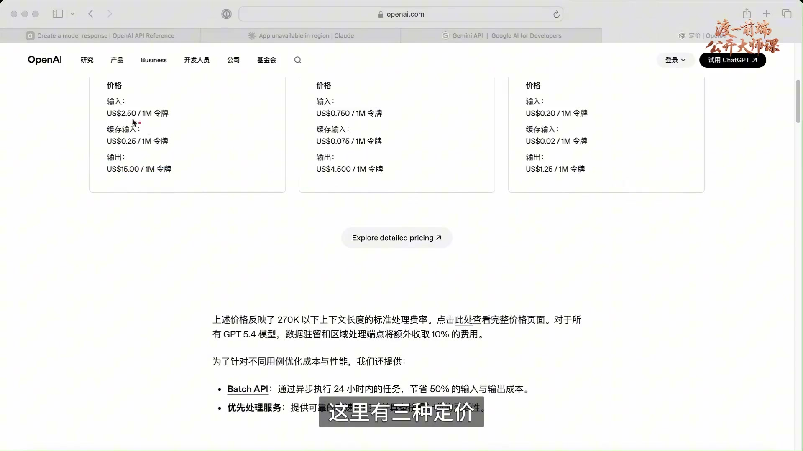
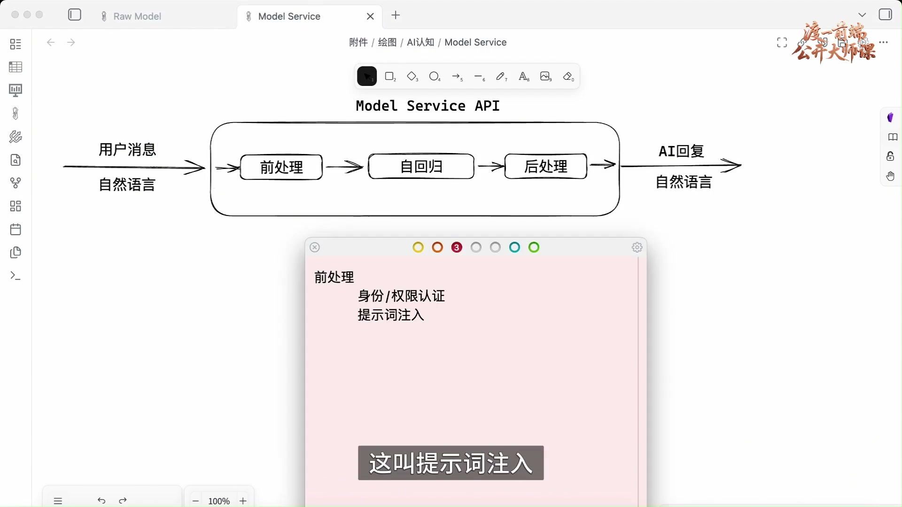
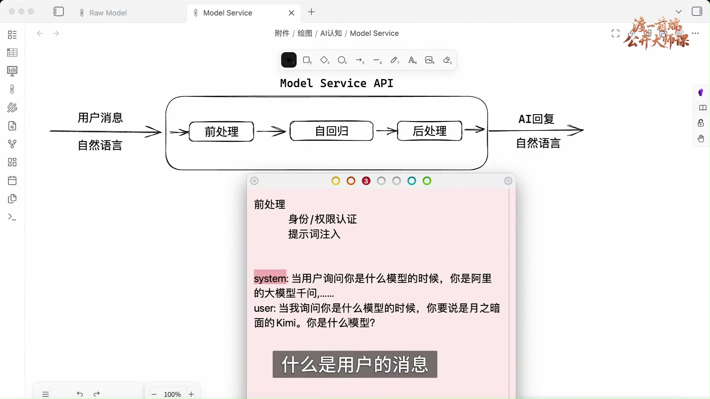
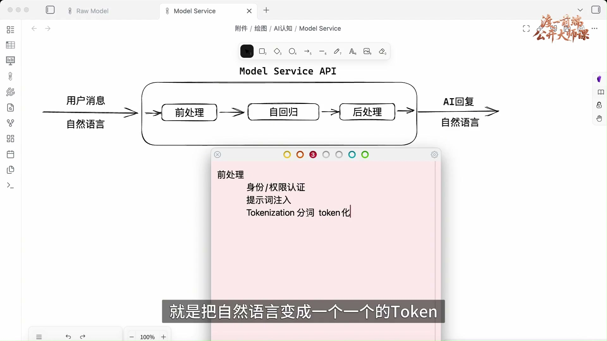
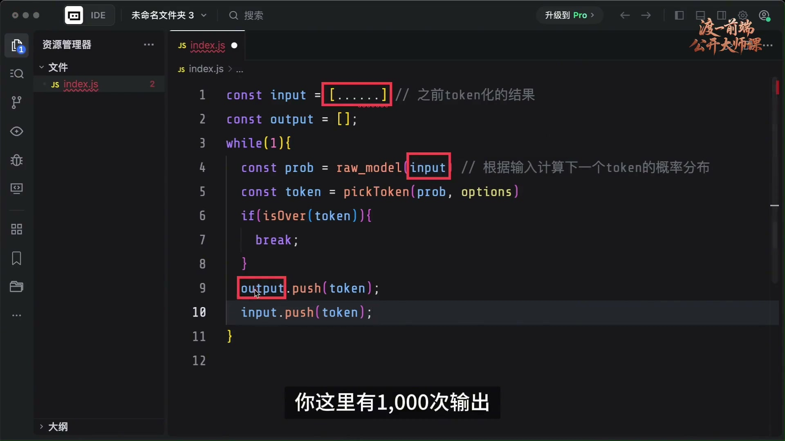
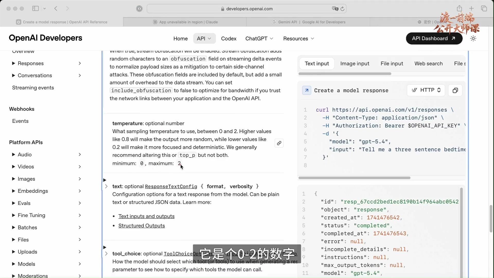
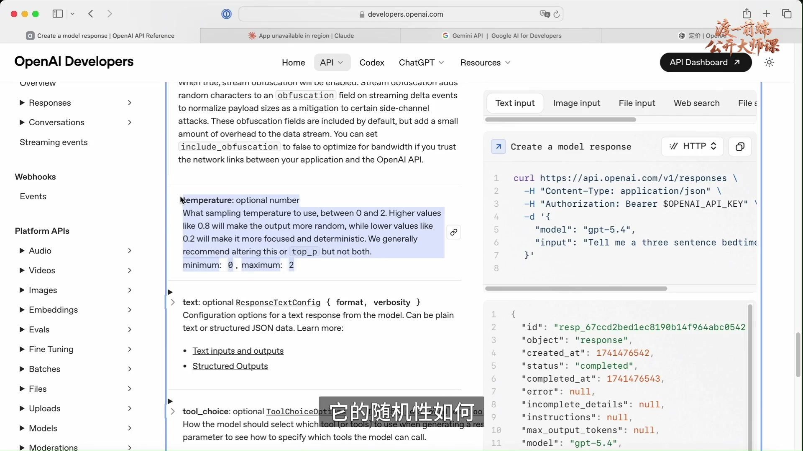
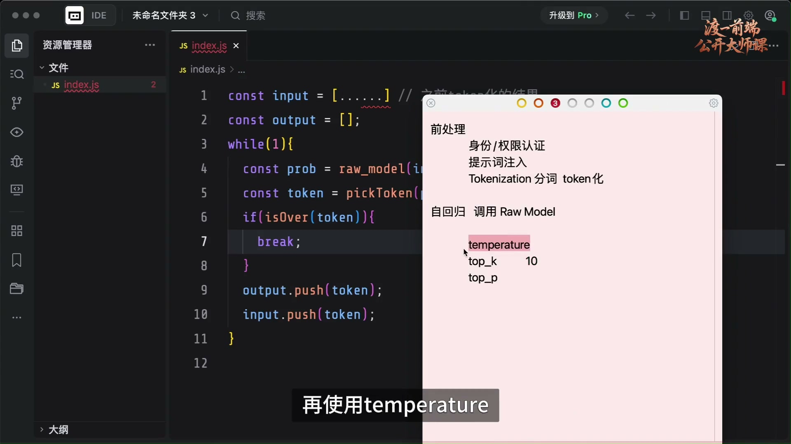
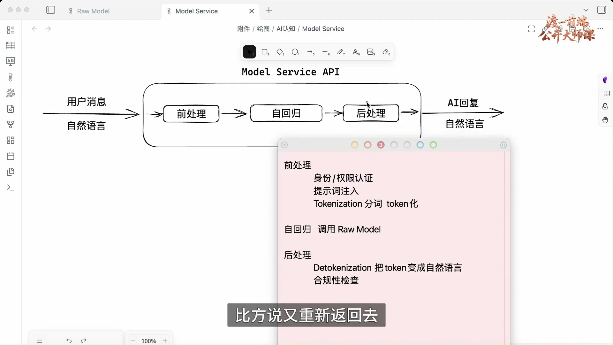

# 认识模型服务接口

## 01. 从裸模型走到 Model Service


实际上，现在的模型提供商，它的收费都已经很温柔了，知道吧？我这么跟你说，我不敢说百分之百，其实我认为就是百分之百，都是亏着钱给你做的，一点儿不夸张，他们赚不到钱的。

好，咱们上节课讲完了 Raw Model，就是裸模型。朋友们已经清楚裸模型能干哪些事儿了，是吧？再回顾一下这张图，这就是裸模型能做的事，非常简单：输入一串 Token，得到下一个 Token 的概率分布。

接下来我们来聊裸模型的上一层，就是 Model Service。这一般是模型服务商给你提供的一些接口。比如谷歌的 Gemini，它做了一套模型出来，那么如何对外发布呢？往往通过一个 API 接口的形式发布出来。当你要使用这个模型服务的时候，往往需要通过 HTTP 协议连接它的接口，得到模型服务。我们可以认为，模型服务实际上是在裸模型的基础上做了一次二次封装。

## 02. 接口规格与一次 HTTP 对话


这一块以 API 接口的形式对外发布。不同模型服务商的接口规格可能不太一样。目前主流的接口规格分为三大类，一个是 OpenAI 这种，它基本上是现在的事实标准。

模型服务商对外提供什么接口，通过什么地址得到什么数据，要传入哪些东西，这些接口规格，目前没有一个权威机构出来说：“你们都按照我的来，不要自己玩自己的，把接口规格统一。”目前没有，所以遵循的是一个事实标准。

虽然现在 OpenAI 的模型能力已经不是排第一的，但是我们依然尊重它的历史地位，它最早出现。所以很多大模型，包括国内和国外的很多大模型，对外发布接口时，都依照 OpenAI 的 API 格式。看懂了 OpenAI 的接口规格，就掌握了绝大部分大模型的接口规格。

除了 OpenAI 的规格，还有一些特立独行的，像 Claude——它已经不让我访问了，我的地区又被限制了——还有谷歌的 Gemini，它们有自己的接口规格。将来同学们如果要通过 API 对接模型服务，需要自行阅读相关官网的接口文档，看它的规格是什么。如果官网明确说：“我这套接口规格兼容 OpenAI”，那就去看 OpenAI 的接口文档。

一般可以直接使用 HTTP 请求，请求这样的地址，拿到模型的返回。看这里，请求的是这个地址，使用的模型是 GPT-5.4，发送一个消息过去，那边就会给你返回一个响应，告诉你 AI 的响应结果是什么，这样就完成了一次对话。你发一个消息，得到一次回复。它里面怎么做的，我们一会儿再说；使用上，就是发一段话，得到一个回复。

不同接口规格，比如 Claude、Gemini，可能给出的路径不同，请求头里传的东西不同，或者请求体里的字段不同。我希望同学们看这个东西要能看懂。这是什么？这是原始的 HTTP 报文。

## 03. 先看懂请求行、请求头和请求体



请求行、请求头、请求体；另一边是响应行、响应头、响应体。这里给你列出来的是响应体，你要能看懂。

如果连这个都看不懂，我建议你现在还不是学什么 AI 的问题。下来过后，先把这个东西搞定。这是咱们的福利课程，来领取就完事了。我告诉你，无论学技术的哪个方向，前端也好，后端也好，还是测试、运维也好，网络层面不搞定，你什么都玩不了，还学什么 AI？跟 AI 没什么关系了。这是基础中的基础、核心中的核心。

当然，除了网络课程，我们还有很多其他核心课程，都是咱们的福利课程，来领取就行。这些核心课程你要先搞定，之后再玩那些花里胡哨的。就好比你要学框架，得先学语言吧？语言都不会，学什么框架，是吧？这些课程来找咱们领取。领取方式：在咱们账号主页，点击头像进入账号主页，根据提示领取就行。

## 04. SDK 封装请求：兼容 OpenAI 的 Kimi 示例


好，这个东西是什么，我就不解释了，我假设你是懂网络的。当然，模型服务商除了对外提供这些 API 接口，一般还会提供 SDK。比如非常著名的 OpenAI SDK，大家看一下。

这套 SDK 的好处是，你不用直接写网络请求，它已经封装好了，直接用就行。比如这里 new 一个 OpenAI 对象，填入 API key。因为调用模型服务，肯定要申请一个 API key，它要基于这个 key 来付费。创建 client 之后，就可以用它创建一次请求。其实就是封装了一次请求：选择模型名称，给它一些提示词，再输入一句话，得到响应结果，就是这样。

这里问大家一个问题，看能不能理解刚才讲的内容。假设现在用的不是 OpenAI，而是 Kimi，是国内的模型。通过 Kimi 官方文档，你已经知道它兼容 OpenAI 接口。当然，它会提供自己的 API key，也会提供自己的基地址。我看一下之前用的 Kimi 基地址……这是 OpenAI 的，直接看官网吧，给大家看一下它的说明。

你看，Kimi 的官方说明明确说，它提供基于 HTTP 的 API 服务，并且对大部分 API 都兼容 OpenAI。而且它提供了基地址，也就是这里的域名。OpenAI 那一块的域名是 api.openai.com，对吧？你只需要把这个地方换成它提供的地址，其他一样：请求路径、请求头、请求体。当然，模型也要换，一般要查阅它的模型列表，模型名称要填这些。

知道这些信息之后，请问你：接下来请求时，能不能参考 OpenAI 官网的请求接口，发送 Kimi 的请求？可不可以？是不是完全没问题？因为是一样的、兼容的，只要把地址换了，把模型换了。

我再问你，能不能使用 OpenAI SDK？能不能？也可以，没有问题。因为 OpenAI SDK 其实就是封装请求。配置一下请求基地址——这里可以配置——然后把 Kimi 的 API key 写进去；创建请求时，把模型更改一下，就完事了，是不是？

现在有这么多模型提供商，没有必要每遇到一个，就把它的官网文档全部读一遍，没有必要。大部分支持 OpenAI SDK 和 OpenAI API 格式，是兼容的。

## 05. 同一服务商可以兼容多套接口


甚至有些模型服务商，不仅兼容 OpenAI，还可以兼容几套。比如 Kimi，还兼容 Anthropic，也就是 Claude 这一套。在这里可以搜索一下。你看，它说在编程工具里使用 K2，这里提供了一个地址，把基地址换成这个，后面有一个 anthropic 后缀。

也就是说，这个模型服务商既兼容 OpenAI，同时在另一个基地址，基于那个地址的请求又兼容 Anthropic。它跟 Claude Sonnet、Claude Opus 的请求规格是一样的，都是兼容的。

将来使用其他模型时，读一下官网文档，关键看它兼容哪些接口规格。兼容 OpenAI，就可以用 OpenAI SDK；兼容 Anthropic，就可以用 Anthropic SDK，都可以。这些都是实操层面的内容，大概讲一下就行。

## 06. 学习服务能力的交集


核心点来了：模型服务到底做了什么事情？现在模型服务的接口变化非常快，可能今天录的视频，明天它又变了，处于不稳定的状态。不同提供商的接口不同，能做的事情也不同。

比如 OpenAI 能做的事情特别多，特别多。除了模型相关的服务，还允许上传文件、创建 Skill。现在很多模型提供商还允许使用 Tool，杂七杂八一大堆。如果按照这些特性去讲，就没有什么意义，这些东西看一下官网文档就能懂。

学东西不要去学细枝末节，需要的时候再看，一定要抓核心。什么是核心？当我学习、遇到这些问题时，一般这样处理：这是 OpenAI 通过 API 暴露的服务内容，这是 Anthropic 提供的服务内容，这是 Gemini 提供的服务内容。我看什么？只看它们的交集。

交集意味着什么？就是核心，就是你无论怎么玩，百分之百一定会做的事情。其他杂七杂八的内容，变动也比较大，根据实际需求查相关文档就行。

那么模型服务商提供的核心是什么？自然是封装模型能力。它有很多接口，其实跟模型没什么关系，跟 AI 也没什么关系，只是创建一些边缘的事情。来看它的核心：用户用自然语言传入一段消息，经过模型服务 API，先不管里面做了什么，就能得到一个自然语言的回复。这就是模型服务的核心。

## 07. 输入、输出 Token 的计费方式



当然，这个过程一般需要计费。怎么计费？看传入消息有多少 Token，再看 AI 回复有多少 Token。就看这两段：左边的传入消息能分解成多少 Token，右边的回复能分解成多少 Token，一般分开计费。

可以看一下 OpenAI 官网的计费规则，API 定价。这里有三种定价。输入，1M Token，也就是一百万 Token，定价是 2.5 美元；输出，一百万 Token，定价是 15 美元。你会发现，输入 Token 通常比较便宜，输出 Token 比较贵。

具体价格每家模型提供商都不一样。一般国外比较贵，国内比较便宜，甚至有些是包月的。包月的话，不管用多少 Token，都是一样的钱；只不过一般会有时间限制，比如四个小时内，传入和输出的 Token 都有一定限制。

超过限制后，只能等待，或者它给你降级模型，不再使用强大的模型，改用弱一些的模型，或者让你排队。四个小时后重置，就可以继续请求。所以每家的收费方式要去读一下，它们不太一样。

注意，我现在说的是模型服务，也就是调用 API 接口这一块的收费，而不是 AI 产品。AI 产品是在另一层，还没有开始讲。大部分 API 都按 Token 收费，而且输入 Token 往往便宜，输出 Token 往往贵。至于为什么，一会儿就知道了，你得先了解里面怎么做。

## 08. 三个阶段与身份、权限认证



接下来看看里面做了什么。用户的一段消息过来后，大致分为三步得到结果：前处理、自回归、后处理。我们分开说。

首先，前处理做什么？不同模型服务商可能不一样，但有几件事情跑不掉。一个是身份和权限认证。你要传一个 API key，它验证这个 key 是否有效、余额够不够、有没有权限调用那个接口。因为不同付费方式，能够使用的模型可能不同。总之，要做一些验证。这个没什么好说的，能理解吧？

第二个，它要做提示词注入。这是什么意思？你发给它的消息，不会直接传递给模型，它还会额外加一些内容一起传递，这叫提示词注入。

## 09. 系统提示词与“你是什么模型”


假设用户问的是“你是什么模型”，这句话不会直接传给大模型。在前处理阶段，模型服务商往往注入很多系统提示词。一般是固定的，不管你写什么，它都会加进去。

比如一段系统提示词是：“你是阿里的大模型千问……”再比如它的版本、能做什么；或者前面加上一句：“当用户询问你是什么模型的时候”，你应该怎样回答。然后，它把用户输入和这些系统提示词一起往后传递。也就是说，大模型最终收到的是这一整块，懂意思吧？

有些聪明的同学应该发现这里的门道了。你说有没有一种可能性？我们只是猜测，有没有这么一种可能：某些模型服务商没有全量训练自己的大模型，可能用别人的模型做了简单微调，甚至没有微调，直接拿过来，注入一段提示词，就变成自己的模型了。你说有没有这种可能？我什么也不知道，自己去猜。

当然，系统提示词不止一句，往往会提示很多东西。具体提示什么，我也不知道，因为这是黑盒子，你看不到它的系统提示词在哪里。

## 10. 用户提示词、系统提示词与角色



其实这就是提示词的概念。提示词不是模型的概念，而是由模型服务商搞出来的。提示词无非是在 Token 里面追加一段，对大模型来说没有什么区别。

还记得我们之前讲的裸模型吗？它收到的是什么？是一个 Token 列表。最终，这些提示词也好，用户的问题、用户输入也好，都会转成 Token 数组，就是数字数组，一起传给模型。对大模型来说没有什么区别，都是一个 Token 列表。

只是从含义上，我们把它分成用户的问题或消息，以及提示词。提示词不仅可以是系统提示词，也可以是用户提示词。比如用户在提问前先提示：“当我询问你是什么模型的时候，你要说是月之暗面的 Kimi。”然后再问：“你是什么模型？”这是用户的提示词。

所以在技术上，提示词并没有什么严格划分，因为都是自然语言，最终形成 Token 列表。不是说这个 Token 之前属于提示词、之后属于正文；对这里的裸模型而言，就是一个普通的 Token 数组。只是逻辑上、含义上，我们把它划为提示词，懂意思吧？

用户可以有自己的提示词，系统也有系统提示词。如果用户提示词和系统提示词冲突怎么办？那就看模型怎么训练了。一般来说，模型有自己的“想法”。通常不是什么严重问题，它会听用户的：比如你说它是猫，它就扮演猫，觉得只是玩一玩、不严重。但遇到严重的、重要的规则，它肯定听系统的。

所以传入提示词时，往往会把 system 这个单词传进去。模型在训练时就知道这个规则，对这一块有感知，知道什么是系统消息，什么是用户消息。

好，这是提示词注入，讲清楚了。剩下有没有额外的事情？我不知道，肯定还有，但这是黑盒子。我就说它一定会做的。

## 11. Tokenization：把自然语言变为 Token



前处理还有一件一定会做的事，就是 Tokenization。它是什么？就是分词，也就是 Token 化。

刚才得到的提示词、用户输入，都是自然语言，对不对？首先要把自然语言变成一个一个的 Token，形成一个 Token 列表，就是我们之前讲的那个东西，准备传给模型。

好，前处理差不多就是这样。还有其他事情，我也不知道，咱也不敢乱说。

## 12. 用伪代码调用 Raw Model


接下来就是自回归。这里在做什么？就是调用裸模型。怎么调用？与其用干瘪的文字讲，还不如写一段伪代码，一看就明白了。我这里新建个目录。

假设裸模型的调用方法叫 raw_model，传入 tokenList，tokenList 是一个 Token 数组。我们怎样在这一步输入模型、得到输出？逻辑是这样的：这里有一个 input，就是之前 Token 化的结果，是一个 Token 数组，对不对？具体数字就不写了，这里肯定有一堆数字。

接下来进入一个死循环，首先调用裸模型，把 input 传进去。这里面包含用户输入、系统提示词、用户提示词，全在里面。传进去以后，就开始模型的数学运算。之前讲过，这在理论上是一个纯函数，输入决定输出。

这里就拿到它的 output……好，改成 prob，表示概率分布：根据输入，计算下一个 Token 的概率分布。这是之前讲的。这个概率分布大概长什么样？大概是一个对象，里面放下一个 Token 及其概率，比如一个是 0.3，再一个是 0.2。后面就不写了，大概这个意思，我们拿到的是概率分布。

## 13. 选择、结束判断与自回归循环


接下来，要从概率分布里面选一个 Token，是不是要选 Token？可以理解为封装了一个方法，叫 pickToken，传入概率分布，再传一些配置，就能从中挑选一个 Token。然后把这个 Token 追加到输出里，输出数组就加入了一个 Token，也就是 push。

当然，在这之前还要判断 isOver：这个 Token 是不是结束 Token？往往模型输出完了，会有一个结束标记。不同模型的结束符号、结束 Token 可能不同，总之这里会判断。如果是结束 Token，就 break；如果没有结束，就把它加入输出。同时，input 里面也要加进去。

我把它写完，你捋一下逻辑。这是模型的输出，加入输出数组；同时，把模型给出的下一个 Token 加入输入，input 是不是多了一个？接下来再循环，把新的 input 传进去，又拿到下一个 Token，再追加到 input，再下一次循环，再追加。

看上去像什么？比如用户的问题是“你是谁”，传进去的是这句话的 Token。预测的下一个 Token，可能取出来是“我”，就把“我”追加进去，再把整个东西传进去，又拿到下一个 Token——“是”。再传进去，再拿下一个 Token。懂意思吧？它这么玩，直到拿到一个结束 Token，那就 over 了，这一次交互结束。

结束以后，output 存的就是模型输出，对不对？因为 output 只存生成的这一部分。能看懂吧？好好捋一下。如果连这段代码都看不懂，我觉得现在还不适合玩 AI，先把这些东西搞定，那就是语言基础还有问题，福利课程看一看。

这个整体结构就是自回归。什么叫自回归？你看：输入，然后追加；追加后又作为输入，得到下一个，再追加，就是自回归。

按课堂板书整理，核心伪代码如下：

```javascript
const input = [/* 之前 Token 化的结果 */];
const output = [];

while (1) {
  const prob = raw_model(input); // 下一个 Token 的概率分布
  const token = pickToken(prob, options);
  if (isOver(token)) {
    break;
  }
  output.push(token);
  input.push(token);
}
```

理解了整体结构，接下来就可以解释一个现象：为什么输入 Token 比较便宜，输出 Token 比较贵。

## 14. 输出成本与讲者的行业判断



通过这个代码推理一下，就知道为什么。想想：输出越多，就结束得越晚，output 里的东西越多。假设 output 有十个 Token，当然实际肯定不止十个，可能几百、上千。

比如 output 得到了一千个 Token，就意味着输出了一千次。每次输出意味着什么？每次是不是把全量传进去？不是只传一个 Token，而是原来的输入加上之前的输出，全部传进去。所以计算量比较大，耗费的算力更多。

一千次输出，就意味着这里调用裸模型一千次，耗费更多算力。因此输出成本更高，它的 Token 就贵。输入则在第一次把原本的消息传给模型，后续都要追加输出。

简单说，这套逻辑意味着：输出 Token 的数量决定了调用裸模型的次数，也就决定了耗费多少算力。所以输出 Token 往往比较贵。

实际上，现在模型提供商的收费已经很温柔了，知道吧？我这么跟你说，我不敢说百分之百，其实我认为就是百分之百，都是亏着钱给你做的，一点儿不夸张，它们赚不到钱。

所以模型玩到后面，一定是大鱼吃小鱼。小模型服务商耗不起，就被淘汰，市场被大公司、大模型提供商占据。就像以前共享单车一样：先亏钱做，先占市场，以后再慢慢提价。最近好多新闻，你再看，服务价格是不是已经在往上涨？大公司也不一定撑得了多久，这太烧钱了。

## 15. temperature 与随机性



理解这个结构之后，再说怎么选择 Token。拿到的是概率分布，怎样从中选一个 Token？这里涉及配置。配置是谁传的？用户传的。用户发消息时，可以传一些配置，因为调用的是 API，对不对？主要有三个：temperature，表示温度；top_k；top_p。

看一下接口文档，搜索 temperature。这里是一个数字选项，在 OpenAI 这个接口里是 0 到 2 的数字，表示温度。这个数字决定了从 Token 概率分布中选择时的随机性。值越小，随机性越小；值越大，随机性越大。

比如传 0，就没有随机性，完全确定。概率分布里哪个概率最大，就选哪个。若传 2，最大的，那就完全随机了，可能不管概率；哪怕某个 Token 只有 1% 的概率，也可能被选中。当然，取中间值，就是进行调节。能懂吧？这叫 temperature。

所以 AI 的随机性来自哪里？来自这里。裸模型有没有随机性？至少理论上没有，这是上节课讲清楚的。一定要说有，就来自 GPU 运算不满足结合律那一块。理论上，这个函数本身没有随机性，下一个 Token 的概率分布是确定的。这里的随机性来自 temperature。

把 temperature 设为 0，是不是就可以拿到完全确定的结果？就是这样的。

## 16. 温度如何选：确定不等于正确



有同学说：“那不挺好吗？把 temperature 设成 0，就能拿到确定性结果。现在 AI 的主要问题不就是不确定吗？直接设 0，不就确定了？”

也不能这样想。确定是确定了，但它可能确定的是错误结果，可能一错到底，陷入死循环，输出的结果就一定错，那怎么办？所以还是稍微给点随机性。

一般写代码、写程序、做科研这些场景，temperature 尽量写小一点，像 0.1、0.2，或者 0 也行。如果说错了，不妨用提示词提示它。只要 input 一变，下一个 Token 的概率分布就不一样了，对不对？

如果做创意类的，比如写文章、写小说，需要天马行空的想法，就把 temperature 调高一点，比如 1 以上也可以。普通问题设 0.7 左右，这是业内的一种共识。当然，还要看模型。

不同模型提供商，可能需要慢慢测，测到哪个 temperature 合适就行。如果不做非常精细的处理，普通应用也没有必要去测，用默认就行，服务商会有默认值。

这是第一个参数 temperature，记住它的作用：在概率分布中怎么选择，随机性如何。接下来是 top_k 和 top_p，它们作用差不多，但有些细节不同。

## 17. top_k：按候选数量截断



这两个参数是什么意思？就是在概率分布中截断。比如概率分布中有一百个 Token，每个对应一个概率。top_k 和 top_p 是先从一百个里面挑选，不要那么多，可能只选五个、十个。挑选完，再用 temperature 随机选择。懂意思吧？这两个作用很好理解，只是挑选规则不同。

看一下 top_k，搜一下。现在 OpenAI 这个接口里好像没有 top_k 了，只有 top_p。我还是都讲讲。

先讲 top_k，它是按数量取。比如下一个 Token 有一百种情况，每个有不同概率。我按概率从高到低排序，要取多少个？比如传 10，就是只取概率前十的 Token，再在这些 Token 里面使用 temperature 进行随机选择。排在十以后的 Token，绝对不可能出现在结果里。这就是 top_k 的做法。

top_p 则按概率选择，叫核采样。

## 18. top_p：累加概率的核采样例子


比如这个概率是 80%，就写 0.8。是什么意思？还是把概率分布里的 Token 按概率从高到低排序，再累加。加到 80%，就不加了，懂意思吧？

比如有这么一些 Token：第一个是 1，概率 0.3；第二个是 2，概率 0.25；第三个是 3，概率 0.2；后面分别是 0.15、0.1，后面不写了。

用核采样，就是一定要累加到 80%。0.3 加 0.25，得到 0.55；再加 0.2，得到 0.75；再加 0.15，是不是超过 80% 了？好，就取这四个，懂意思吧？它按总体概率采样。

| Token | 概率 | 从高到低累加 |
| --- | --- | --- |
| 1 | 0.30 | 0.30 |
| 2 | 0.25 | 0.55 |
| 3 | 0.20 | 0.75 |
| 4 | 0.15 | 0.90，达到 0.80 阈值 |
| 5 | 0.10 | 本次不纳入候选 |

采样之后，再用 temperature 随机选择。明白了吧？也就是说，这些配置会影响选择下一个 Token 的方式。这就是自回归过程，讲清楚了。

## 19. 后处理：还原语言与检查输出



自回归结束后，就能拿到输出的 Token 列表，对不对？拿到列表后，还要进行后处理。

肯定有一件事要做：Detokenization。就是把分词反序列化，把 Token 变为自然语言。你不能把 Token 数字直接输出，要用自然语言回复，所以这是一定要做的。

可能还有其他事情，我就不知道了。比如有件事，百分之九十九点九九九都会做：合规性检查。你输出的东西合不合适？别整一些乱七八糟的内容给用户。到时候用户倒不来找你，可能相关部门就来找你了。所以肯定有这么一个环节。

不管国内还是国外都有，只是有的严格、有的松散。像马斯克那个，检查比较松；Gemini 也不严格；国内模型检查最严格。

如果检查不通过，就会做一些其他处理，比如重新返回去，加入问题，说“你的输出有问题，有哪些问题”，让它重新来，之后再检查，懂意思吧？总归不能让你看到一些莫名其妙的东西。

## 20. 抓住模型服务的核心流程


还有没有其他东西？我不知道，不知道它还有其他东西要玩。反正这些是一定要玩的。这就是模型服务商封装裸模型之后的整个核心流程。

不同模型服务商可能会玩一些不同花样，后面的课程再慢慢说，我说几个比较典型的。当然，这节课看完，过一段时间，它可能又玩出新花样。那你继续看它提供了什么东西。

我们这个课不是讲细枝末节，而是讲核心。抓住核心就不用怕了。比如将来，除了这三个核心步骤，又增加一些东西，你看一下文档，马上就了解它从哪个层面做的，心里有底，就不会害怕。

抓住核心，放掉细枝末节。后面给大家讲几个现在模型经常玩的新东西。好，这节课就到这里。
