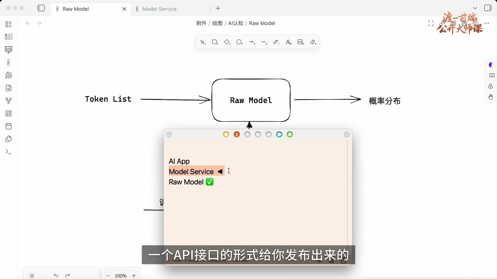
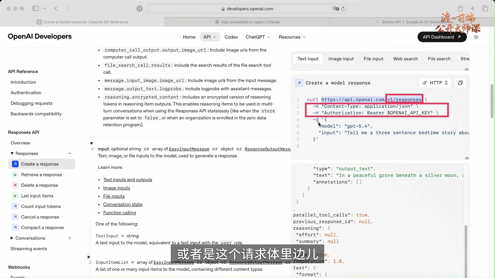
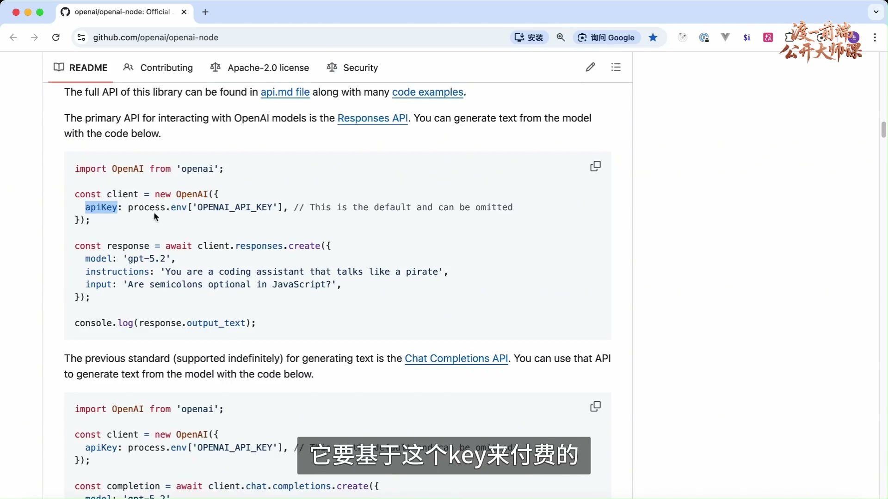
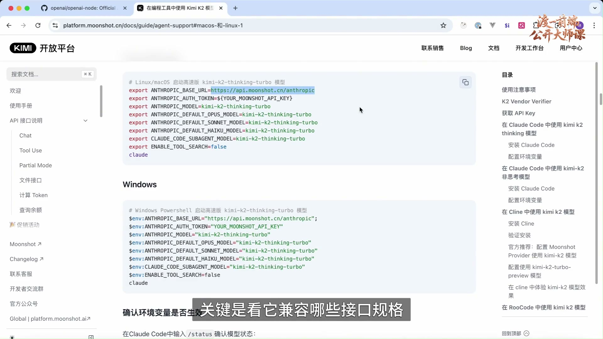
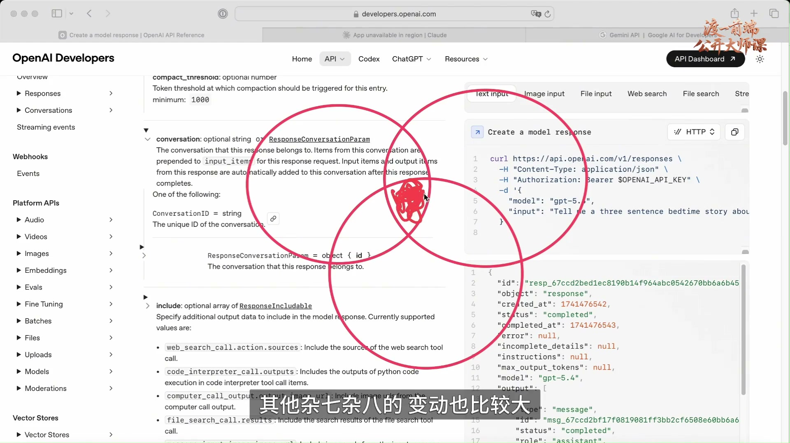
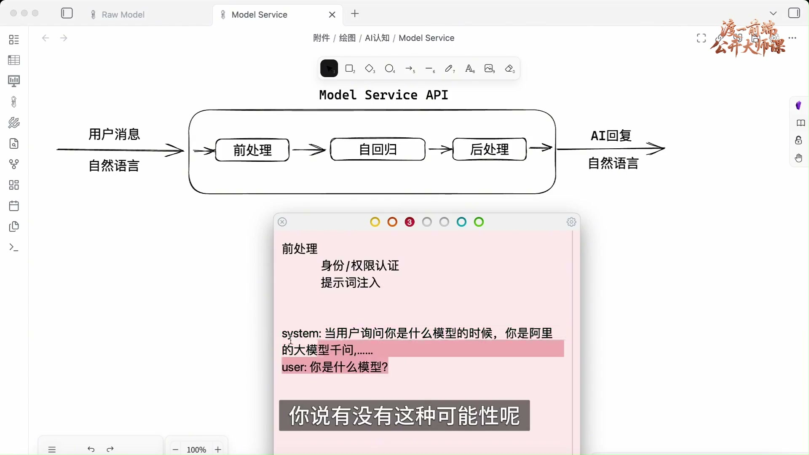
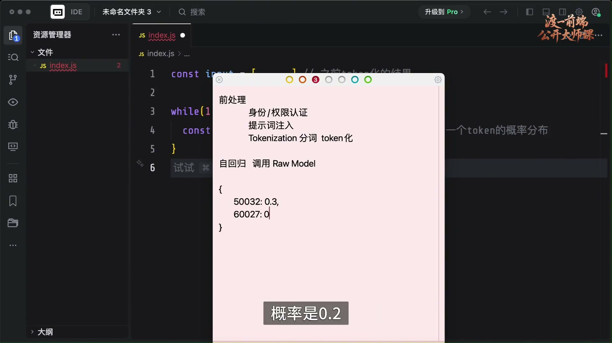
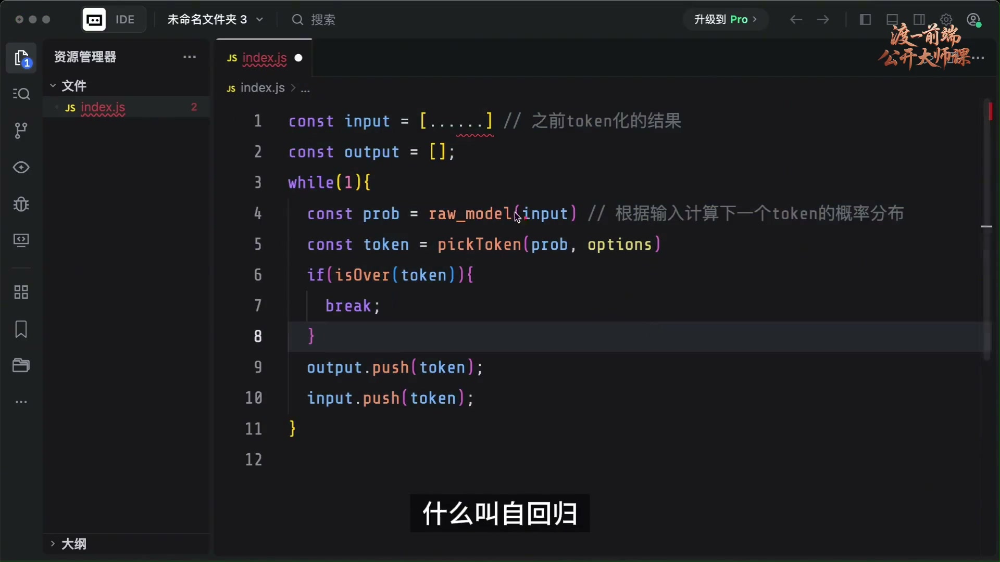
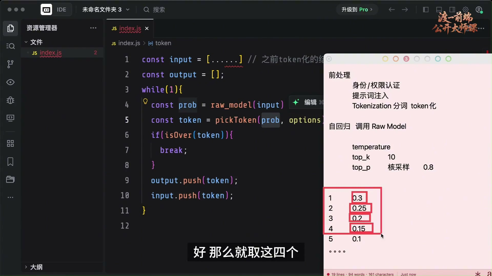
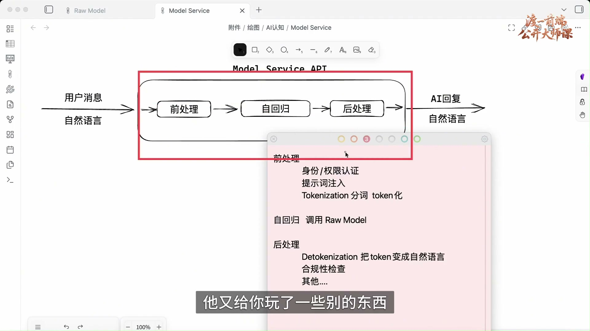

# 认识模型服务接口

## 01. 从裸模型走到 Model Service



上一节介绍了 Raw Model：输入一串 Token，得到下一个 Token 的概率分布。这是理解模型服务的基础。

Model Service 位于裸模型之上，通常由模型服务商以 API 形式提供。例如 Gemini 等模型通过 HTTP 接口开放能力，程序连接接口即可获得服务。模型服务可以理解为对裸模型的进一步封装。

### 画面与校读说明

板书将 AI App、Model Service、Raw Model 分为三个层次，底层图示为 Token List → Raw Model → 概率分布。有关模型服务成本的行业判断放在后文讨论，不作为已经核实的财务结论。

## 02. 接口规格与一次 HTTP 对话



不同服务商的 API 规格可能不同。原课主要对比 OpenAI、Anthropic 和 Gemini 三类接口，其中 OpenAI 格式被作为广泛采用的事实标准介绍。

接口规格规定请求地址、输入内容及返回数据。原课指出，这些接口并未由统一机构规定，而是在实际使用中形成兼容约定。

原课从 OpenAI 的历史影响解释其接口格式的普及：不少国内外模型服务采用兼容格式。掌握这一规格，有助于理解其他兼容服务的调用方式。

Claude、Gemini 等也有各自的接口规格。对接时应查阅服务商官方文档；若文档声明兼容 OpenAI，则可以参考对应的 OpenAI 接口说明。

示例通过 HTTP 请求指定地址，选择 GPT-5.4 并发送消息，再从响应中获取模型回复，从而完成一次对话。这里先理解调用方式，后续再分析服务内部流程。

不同规格可能在路径、请求头、请求体字段等方面存在差异，因此需要能够阅读原始 HTTP 报文。

### 画面与校读说明

浏览器展示 OpenAI 的 Create a model response 文档及 HTTP 示例。课堂示例地址为 https://api.openai.com/v1/responses，请求头包括 Content-Type: application/json 和 Authorization: Bearer $OPENAI_API_KEY，请求体包含 model 与 input。接口与模型名称属于录制时的示例；排名、历史地位等措辞保留讲者原观点。

## 03. 先看懂请求行、请求头和请求体

HTTP 请求包含请求行、请求头和请求体；响应包含响应行、响应头和响应体。示例文档展示了响应体的内容。

理解 HTTP 报文和网络请求，是对接模型服务的基础。前端、后端、测试和运维等方向都需要具备相应的网络知识。

### 画面与校读说明

本节保留 HTTP 请求与响应的基础知识，相关结构可参考前一节的接口文档示例。

## 04. SDK 封装请求：兼容 OpenAI 的 Kimi 示例



模型服务商除提供 API 外，通常也提供 SDK。OpenAI SDK 是本节采用的示例。

SDK 封装了网络请求。示例先创建 OpenAI 对象并填入 API key，得到 client，再指定模型、提示词和用户消息发起请求，获取响应。API key 用于识别调用方及相应计费。

如果改用 Kimi，需要先从其官方文档确认兼容规格、API key 和请求基地址。

原课展示的 Kimi 文档说明，其基于 HTTP 的 API 对大部分 OpenAI API 兼容。接入时将 api.openai.com 替换为 Kimi 提供的基地址，并从模型列表中选取对应名称；请求路径、请求头和请求体按兼容规格处理。

因此，在兼容范围内，可以参考 OpenAI 文档构造 Kimi 请求，并替换相应地址、凭据和模型名称。

也可以继续使用 OpenAI SDK：配置 Kimi 的请求基地址与 API key，创建请求时指定 Kimi 模型。SDK 的职责仍然是封装请求。

面对不同服务商，先确认其兼容范围，再重点阅读差异部分，可以减少重复学习。

### 画面与校读说明

画面先展示 openai-node 的创建 client 与请求示例，再切换 Kimi 文档查看兼容说明与模型列表。课堂迁移操作围绕基地址、API key、模型名称三项展开。“其他一样”保留原课在兼容接口前提下的说法，不扩展为所有提供商、所有端点均完全相同。

## 05. 同一服务商可以兼容多套接口



同一服务商也可能兼容多套规格。原课以 Kimi 为例，展示其兼容 Anthropic 的服务地址，基地址中带有 anthropic 后缀。

因此，一个服务商可以在不同基地址下分别提供 OpenAI 和 Anthropic 兼容接口，后者与 Claude Sonnet、Claude Opus 所用的请求规格相对应。

使用其他模型时，先查明兼容哪套接口，再选对应 SDK：例如 OpenAI SDK 或 Anthropic SDK。

### 画面与校读说明

课堂查看 Kimi 在编程工具中使用 K2 的文档，并比较不同基地址下的协议兼容。Anthropic、Claude Sonnet、Claude Opus 根据画面与上下文统一拼写。

## 06. 学习服务能力的交集



模型服务的接口与功能更新较快，不同提供商的能力也存在差异。分析时应先关注它们共同承担的核心职责。

例如，原课提及上传文件、创建 Skill、使用 Tool 等扩展能力。这些具体特性可以在需要时查阅官方文档。

一种学习方法是对照 OpenAI、Anthropic、Gemini 提供的服务，找出其中的共同部分。

这些共同能力构成理解模型服务的基础；变化较快的扩展功能，则根据实际需求继续研究。

本节讨论的核心是模型能力封装：用户以自然语言传入消息，经由模型服务 API 获得自然语言回复。其他辅助接口可以在掌握核心流程之后再理解。

### 画面与校读说明

板书用各服务能力的交集引出核心，再展示“用户消息／自然语言 → Model Service API → AI 回复／自然语言”的总图。文件、Skill、Tool 是原课列出的接口功能例子。

## 07. 输入、输出 Token 的计费方式


模型服务一般根据输入和输出的 Token 数量计费，两部分通常分别计算。

原课展示的 OpenAI API 定价示例为：每 1M 输入 Token 2.5 美元，每 1M 输出 Token 15 美元；1M 表示一百万。这里只保留录制时的价格示例。

不同服务商价格和套餐不同。原课比较了国内外价格差异，并介绍包月套餐：固定月费下，可能仍有滚动时间窗口的用量限制，例如四小时内输入、输出 Token 的限额。

超过限额后，服务可能要求等待、排队或切换到较弱模型，额度重置后再继续请求。具体计费与限制需分别查看服务说明。

这里讨论的是模型服务 API 的收费，AI 产品位于另一层。输入 Token 通常比输出 Token 便宜，后续通过生成流程解释这一差异。

### 画面与校读说明

价格页包含输入、缓存输入和输出三个项目。原课口头重点讲输入 2.5 美元／1M Token 与输出 15 美元／1M Token。这里完整保留录制时价格和四小时限制的举例，不作为当前报价、各平台包月规则或无限用量的保证。

## 08. 三个阶段与身份、权限认证


从用户消息到最终回复，模型服务的核心流程可以分为前处理、自回归和后处理。

前处理首先涉及身份和权限认证：验证 API key 是否有效、余额是否充足，以及是否具有接口和模型的使用权限。不同付费方式可能对应不同可用模型。

服务还可能添加提示词，将额外内容与用户消息一起传给模型。本节将这一服务侧操作称为提示词注入。

### 画面与校读说明

Model Service API 总图分为前处理、自回归、后处理。前处理清单先写“身份／权限认证”，再写“提示词注入”。这里的“提示词注入”沿用原课，指服务端补入系统提示词，并非在讨论外部恶意提示攻击。

## 09. 系统提示词与“你是什么模型”



以“你是什么模型”为例，前处理阶段可能加入固定的系统提示词，再与用户问题一起传入模型。

例如，系统提示词写明“你是阿里的大模型千问……”，补充版本、能力，或规定被问及模型身份时如何回答。模型最终接收的是这些内容与用户输入的组合。

原课据此提出一种假设：服务商可能使用其他模型、进行简单微调，或通过身份提示词改变模型的自述。这只是用于说明提示词作用的猜测，并非对具体服务商的事实认定。

系统提示词通常不止一句。对外部调用方而言，服务内部的完整提示词可能不可见。

### 画面与校读说明

板书记下系统提示示意：“当用户询问你是什么模型的时候，你是阿里的大模型千问……”以及用户问题。关于模型来源和简单换牌的内容，原课明确以猜测提出，保留该限定。

## 10. 用户提示词、系统提示词与角色


在本节的分层视角中，提示词属于服务层组织输入的方式，最终也会转化为模型接收的 Token。

系统提示词、用户提示词和用户问题会一起转换为 Token 数组，再传给裸模型；从底层输入形式看，都是数字列表。

从用途上，可以区分系统提示词与用户提示词。例如，用户先要求“当我询问你是什么模型的时候，你要说是月之暗面的 Kimi”，再问“你是什么模型”，前一段就是用户提供的提示。

因此，提示词与正文的划分主要体现其逻辑用途。本节用统一的 Token 数组说明它们如何进入裸模型。

系统提示词与用户要求冲突时，处理方式与模型训练有关。原课用扮演猫的例子说明普通角色要求，并将重要系统规则与此类请求作区分。

消息中常通过 system 等角色标记区分系统与用户内容，模型在训练中学习相应的角色规则。

服务商可能还有其他内部处理；本节只分析能够据此理解的核心环节。

### 画面与校读说明

原课用 system 与 user 两段文字演示提示冲突，并用“扮演猫”解释低风险角色扮演。本节保留讲者对裸模型输入的抽象，后文也保留其对角色训练的补充；不能把“都是 Token”理解为服务层不存在角色标记或优先规则。

## 11. Tokenization：把自然语言变为 Token


另一项前处理是 Tokenization，即分词或 Token 化。

将自然语言形式的提示词与用户输入转成一个个 Token，形成可传给模型的 Token 列表。

### 画面与校读说明

前处理清单完整写出“身份／权限认证、提示词注入、Tokenization 分词 token 化”。讲解随后返回 Raw Model 图中的 Token List，衔接下一步调用。

## 12. 用伪代码调用 Raw Model



接下来进入自回归阶段，通过伪代码说明如何反复调用裸模型。

假设调用方法为 raw_model，接收 tokenList。示例中的 input 就是前处理得到的 Token 数组，包含用户输入与各类提示词。

循环中先将 input 传给 raw_model，执行模型运算。在前一节采用的理论抽象中，输入决定相应的概率分布输出。

用 prob 保存结果，即下一个 Token 的概率分布。可以将其表示为候选 Token 与概率的对应关系，例如某些候选的概率分别为 0.3、0.2。

### 画面与校读说明

编辑器使用 JavaScript 风格伪代码：const input = [......]；while(1) 中执行 const prob = raw_model(input)。变量名由 output 改为 prob；便签展示 Token 与 0.3、0.2 等概率。省略号是课堂占位示意，不是可直接运行的完整程序。

## 13. 选择、结束判断与自回归循环



通过 pickToken(prob, options) 从分布中选择一个 Token；options 表示采样配置。选出的 Token 将在结束判断之后加入输出。

先调用 isOver 判断是否为结束 Token。不同模型的结束标记可能不同；若已经结束则 break，否则将 Token 同时追加到 output 和 input。

新 Token 加入 input 后，下一轮使用扩展后的输入再次预测；生成结果不断追加，形成循环。

例如，用户输入“你是谁”，先预测出“我”，再将“我”加入输入；下一轮可能得到“是”，继续追加，直到选出结束 Token。

循环结束后，output 只保存本轮生成的内容。理解这段代码需要掌握数组追加、循环与条件判断等语言基础。

这种将生成结果追加到输入、再预测下一项的过程，就是本节说明的自回归。

按课堂板书整理，核心伪代码如下：

```javascript
const input = [/* 之前 Token 化的结果 */];
const output = [];

while (1) {
  const prob = raw_model(input); // 下一个 Token 的概率分布
  const token = pickToken(prob, options);
  if (isOver(token)) {
    break;
  }
  output.push(token);
  input.push(token);
}
```

理解了整体结构，接下来就可以解释一个现象：为什么输入 Token 比较便宜，输出 Token 比较贵。

### 画面与校读说明

最终伪代码明确保留两次 push：output.push(token) 收集生成结果，input.push(token) 将生成内容带入下一轮。raw_model、pickToken、isOver 与 options 都是课堂抽象，未提供可运行实现。代码块是对画面中代码的排版转录。

## 14. 输出成本与讲者的行业判断


输出越长，循环结束得越晚。例如，output 可能包含十个、几百个或上千个 Token。

在这段简化伪代码中，生成一千个 Token 对应一千次模型调用，每一轮的输入包含原始消息与此前生成的内容，因此需要持续计算。

输入消息在开始时传入，后续不断追加输出。生成更多 Token 会增加模型调用次数与算力消耗。

这解释了原课所讨论的输入、输出计费差异：输出 Token 数量与自回归的运算次数相关。

原课认为，录制时部分模型服务的收费难以覆盖成本。这是讲者的行业判断，未提供财务数据验证。

讲者进一步以共享单车行业作类比，认为持续投入可能推动市场集中，服务商也可能先争取市场、再提高价格。这里保留其分析思路，不将预测写成确定结论。

### 画面与校读说明

讲者在完整循环代码中框出 input、raw_model(input) 和 output.push(token)，解释输出次数与模型调用次数的关系。这是课堂简化成本直觉，原课未展开缓存等工程优化。亏损、市场集中与涨价预测保留为讲者判断，不作为经核实的普遍事实。

## 15. temperature 与随机性


从概率分布中选择 Token 时，可以通过 API 参数控制采样。原课主要介绍 temperature、top_k 和 top_p。

temperature 表示温度。原课所示 OpenAI 接口接受 0 到 2 的数值，用于调节采样随机性：值较低时更集中，值较高时随机性更强。

原课用极端值作简化说明：temperature 为 0 时选择最高概率候选；取较高值时，低概率候选也可能被选中，例如概率仅为 1% 的 Token。中间值用于调节这一倾向。

在本节的理论框架中，裸模型先产生概率分布，temperature 影响随后的 Token 选择。前一节还讨论了 GPU 浮点运算误差与理论确定性的区别。

原课用 temperature 为 0 说明确定性采样，具体限制保留在校读说明中。

### 画面与校读说明

文档展示 temperature 的 optional number、minimum: 0、maximum: 2 及随机性说明。原课以极端值说明采样趋势，并未推导温度公式。相关示例不构成跨模型或跨运行的可复现性保证。无关英文识别尾串已在校读时排除，原始识别文件保留。

## 16. 温度如何选：确定不等于正确


降低随机性并不等于提高正确性。

模型可能持续选择错误结果，甚至重复输出或陷入循环。因此，确定性与答案质量需要分别判断。

原课建议，代码、程序或科研类任务可从较低温度尝试，例如 0.1、0.2 或 0。如果结果错误，也可以调整提示词；input 改变后，概率分布也会改变。

创意写作、小说等任务可以尝试较高温度，例如 1 以上；原课还给出普通问题约 0.7 的经验值。合适设置仍取决于模型与任务。

需要精细控制时，可针对具体服务测试参数；普通应用也可以先使用服务商默认值。

temperature 主要调节选择的随机性；top_k 与 top_p 则用于限定候选范围，两者的截断规则不同。

### 画面与校读说明

画面选中 temperature 文档中较高值、较低值及 top_p 的相关说明。0.1、0.2、0.7、1 以上是原讲者给出的场景经验值；原课同时强调因模型而异、精细场景需测试、普通应用可使用默认值。

## 17. top_k：按候选数量截断


例如，概率分布有一百个候选 Token，可以先通过 top_k 或 top_p 缩小到若干候选，再根据 temperature 进行选择。

原课查阅的 OpenAI 接口中展示了 top_p，未找到 top_k，但仍分别解释这两种机制。

top_k 按数量截断：先按概率从高到低排序，若 k 为 10，则只保留前十个 Token，再在这个集合中采样；其余候选不参与本次选择。

top_p 则按概率选择，叫核采样。

### 画面与校读说明

便签写有 temperature、top_k 10、top_p，编辑器显示 pickToken(prob, options)。原课现场搜索后指出其所看的 OpenAI 接口未提供 top_k，因此不能假定三个参数在每家接口中都可直接使用。这里保留原课先截断、再选择的教学描述，未扩展底层采样处理顺序。

## 18. top_p：累加概率的核采样例子



top_p 按累积概率截断。例如 p 为 0.8，先将候选按概率从高到低排序，再累加至达到或超过 80%。

示例中五个 Token 的概率依次为 0.3、0.25、0.2、0.15、0.1。

前两个累加为 0.55，前三个为 0.75，加入第四个后为 0.90，达到 0.80 阈值，因此保留前四个候选。

| Token | 概率 | 从高到低累加 |
| --- | --- | --- |
| 1 | 0.30 | 0.30 |
| 2 | 0.25 | 0.55 |
| 3 | 0.20 | 0.75 |
| 4 | 0.15 | 0.90，达到 0.80 阈值 |
| 5 | 0.10 | 本次不纳入候选 |

限定候选集合后，再根据 temperature 选择 Token。这些配置共同影响自回归中每一步的选择。

### 画面与校读说明

便签给出 top_p 核采样 0.8，并列出 0.3、0.25、0.2、0.15、0.1。红框圈住前四个候选；它们累计 0.90，前三项只有 0.75。表格将原课口算整理为逐项可读形式。

## 19. 后处理：还原语言与检查输出


自回归结束后，得到输出 Token 列表，随后进入后处理。

Detokenization 将 Token 还原为自然语言，使用户获得可阅读的回复。

后处理还可能包括合规性检查，判断输出是否符合服务规则。

原课认为不同服务商的检查尺度存在差异，并对 Grok、Gemini 与国内服务作了比较。这属于讲者的观察，未在本节提供系统验证。

若检查未通过，服务可能将问题说明加入上下文，要求重新生成，再次检查后返回结果。具体做法取决于服务实现。

### 画面与校读说明

前处理、自回归、后处理的完整清单中，后处理写有“Detokenization 把 Token 变成自然语言”和“合规性检查”。不同产品检查严格程度及“重新生成再检查”的流程是讲者的概括与举例；原课未证明所有服务都采用相同实现。

## 20. 抓住模型服务的核心流程



前处理、自回归、后处理构成了本节介绍的模型服务核心流程；服务商还可能在其上增加其他功能。

面对新增功能，可以继续查看服务文档，确认它如何改变输入组织、生成过程或结果处理。

掌握这三个环节，有助于将新增能力放回整体结构中理解，再按需研究实现细节。

### 画面与校读说明

结尾重新框出 Model Service API 内的前处理、自回归、后处理，完整清单保留在同一画面。下一课预告仅保留原课所说的模型服务扩展，没有补入本视频未讲的流式输出或其他专题。
