# AI 的本质

## 01. 从裸模型、模型服务走到 AI 应用

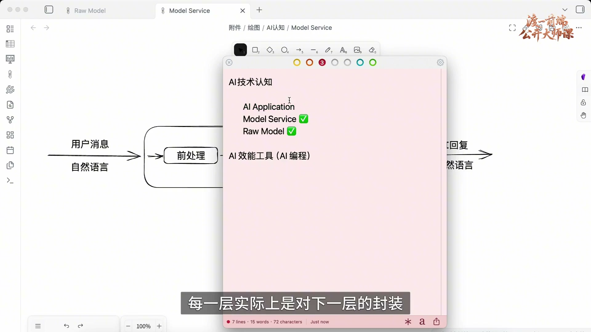

本节介绍理解 AI 新概念的方法：从技术分层出发，追踪模型的输入、输出以及应用对结果的处理。

前两节讨论了裸模型和模型服务，本节进入 AI Application，即 AI 应用层。每一层都对下一层进行封装：模型服务封装裸模型的调用，AI 应用封装模型服务。

## 02. 应用与模型服务的边界为什么会移动

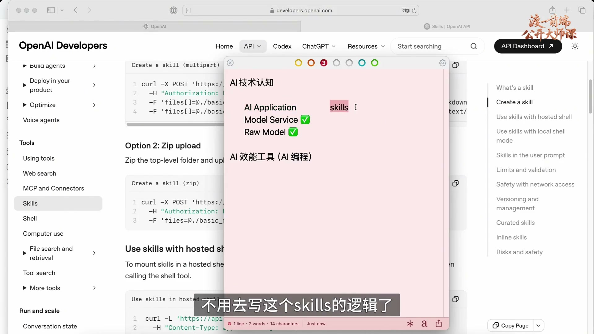

模型服务与裸模型的边界较为清晰：裸模型接收 Token 列表，输出下一个 Token 的概率分布；模型服务通过自回归调用裸模型，并完成前处理与后处理。相比之下，AI 应用与模型服务之间的边界并不固定。

某些功能最初由应用实现，后来会被模型服务商整合进接口。Skills 就是本节的例子：当模型服务层提供相应支持时，应用开发者可以直接调用这部分能力。

原课展示了 OpenAI 接口中的 skills 支持，说明部分技能逻辑可以通过 API 使用。MCP 和 tools 也有类似情况：部分模型服务商直接提供相关支持。

这意味着应用层与服务层需要共同完成相关逻辑。例如，Skills 与模型交互所需的流程，若服务商尚未实现，就需要应用实现；若服务商已经提供，应用可以使用已有能力。

裸模型内部的训练方式、性能、参数和注意力机制可能持续更新，但本节关注的输入输出调用方式相对稳定。模型服务与 AI 应用层的功能和职责变化更频繁。

## 03. 微调案例：训练时间之外，还有验证成本

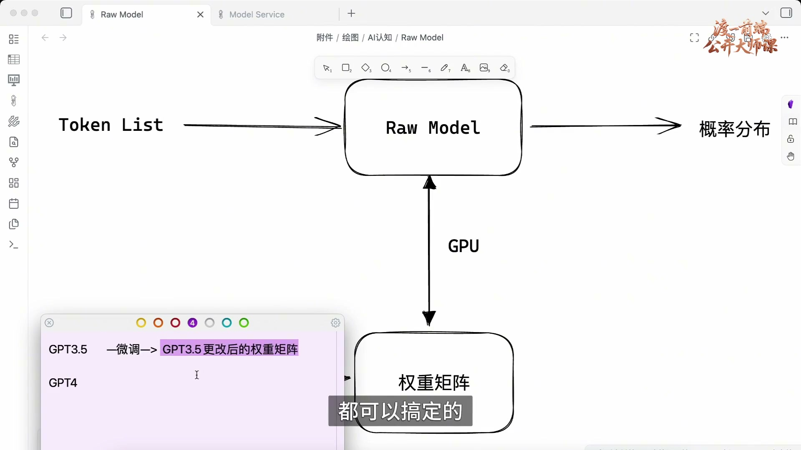

这体现了技术栈中底层抽象相对稳定、上层功能变化较快的特点。训练和微调都会影响权重矩阵；是否进行微调，还需要考虑成本。原课认为，在模型快速更新的阶段，部分场景的微调投入难以获得预期回报。

以 GPT-3.5 为例，企业可能拥有模型训练时未覆盖的内部知识。通过微调，可以在已有权重矩阵的基础上进行二次训练，调整其中的参数，使模型适应这些知识。

微调后会得到调整过的权重矩阵。训练之外，还需要验证结果是否符合预期。原课举例估计，整个过程可能需要两三个月，其中较多时间用于验证。

复杂情况下，验证周期还可能延长到半年。在这段时间里，如果 GPT-4 等更新模型发布，并具备更大的上下文窗口、更准确的理解能力和更少的幻觉，企业可能仅通过提示词就能获得优于旧模型微调的结果。

这里的成本不仅是算力，还包括大量验证工作所需的人力。原课用这一案例说明：模型快速迭代会影响微调的投入产出，调用方式稳定并不意味着模型能力停止变化。

## 04. AI 应用层：应用开发与工具使用

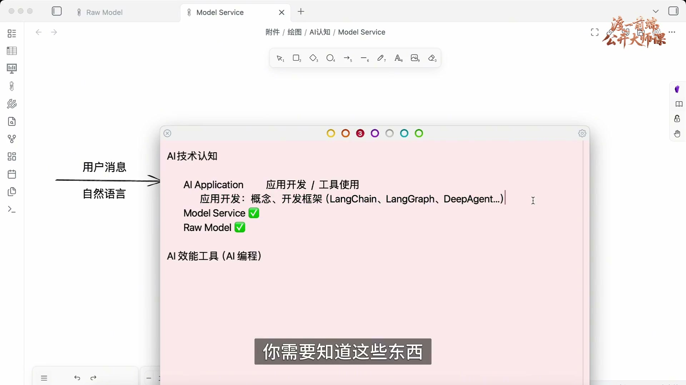

基于上述成本判断，原课将讨论重点转向模型服务和 AI 应用。模型服务商提供接口，应用开发者在其上构建具体功能。应用层可以从应用开发与工具使用两个角度理解。

应用开发是调用模型服务接口，构建有实际价值的 AI 工具。例如 AI Coding 工具属于 AI 应用层；直接使用这类编程工具，则属于工具使用。

AI 应用开发涉及 tools、MCP、RAG、Skills 等概念。这些概念多与应用层相关，但部分功能已经被模型服务层吸收，因此需要结合具体实现判断其所在层次。

即使服务商提供了现成功能，开发者仍需理解相关概念，才能正确调用。应用开发还会涉及 LangChain、LangGraph、DeepAgent 等框架，需要了解它们各自承担的职责。

## 05. 工具使用的定位

工具使用关注如何利用现有 AI 应用提高工作效率，并不要求自行开发工具。理解输入、输出、提示词和工具调用等概念，同样有助于正确使用这些应用。

## 06. 先理解概念，再学习具体编程工具

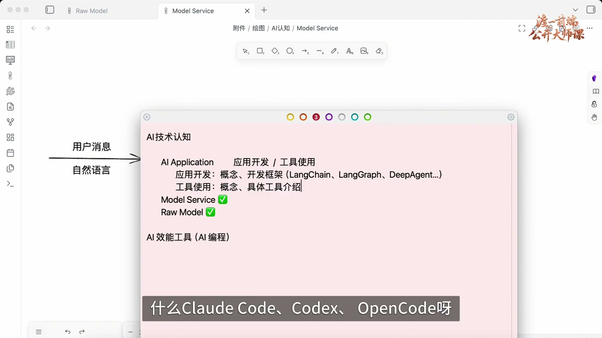

学习 Claude Code、Codex、OpenCode 等编程工具之前，先理解它们涉及的概念，可以更容易掌握配置和使用方式。这里主要面向程序员，讨论 AI 编程工具。

AI 短剧等也属于工具使用，但不在本节讨论范围内。原课还提及 OpenClaw〔名称校读存疑〕等新工具，并指出部分工具生命周期较短。学习时应优先掌握可迁移的方法。

## 07. 理解新概念，只盯住输入与输出

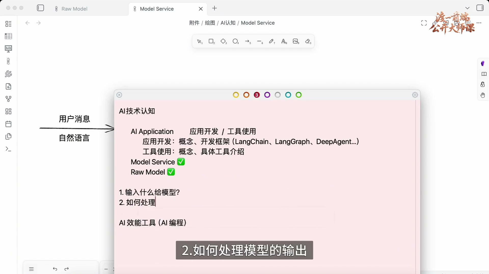

本节重点是理解概念的方法，而非逐个介绍工具。可以将其类比为学习钓鱼的方法：方法能够迁移到不同场景，不依赖某一套具体装备。

AI 领域的新概念持续出现，也可能很快被替代。面对变化，可以先分析它们在既有技术结构中的作用，判断哪些只是实现方式改变，哪些涉及新的能力。

在本节的分析框架中，裸模型之上的工作可归纳为两个问题：输入什么给模型，以及如何处理模型的输出。模型服务与 AI 应用在这两个方面分工，而裸模型负责输入到输出之间的数学运算。

## 08. 用前处理、后处理检查这两个问题

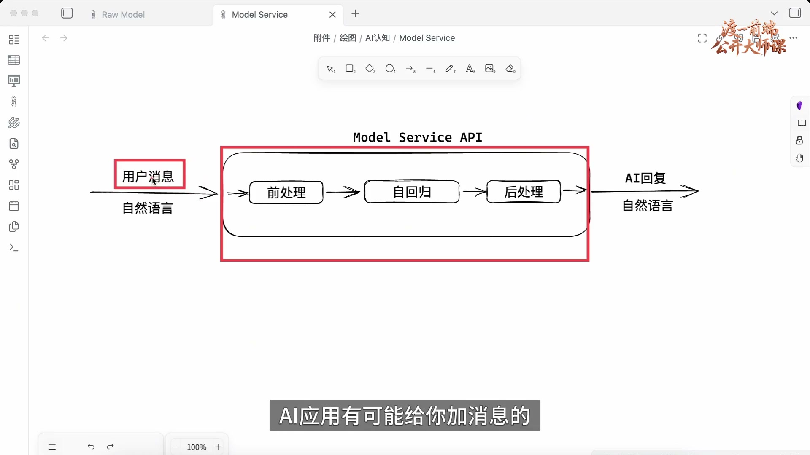

模型服务的前处理体现了第一个问题：将自然语言转换为 Token，并加入系统提示词，最终组织成传给模型的输入。

后处理体现了第二个问题：模型产生结果后，再进行反 Token 化、合规审查等操作。AI 应用也可以沿着这两个方向分析。

对 AI 应用而言，可以将模型服务视为一个黑盒：发送消息，接收回复。用户输入经过应用时，应用还可能加入额外提示词，因此用户填写的消息并不一定等于模型收到的完整输入。

## 09. HTTP 类比：看消息、格式与后续动作

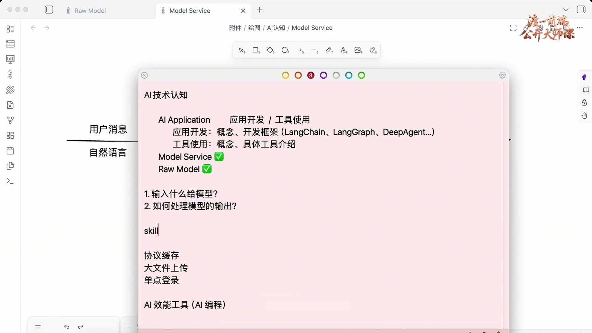

模型返回结果后，AI 应用还会继续处理。MCP、Tools、Skills 等机制也可以从输入与输出的角度理解。这与 HTTP 请求和响应的分析方式相似。

例如，协议缓存涉及请求与响应的格式；大文件上传涉及每次发送的内容、发送次数及响应处理；OAuth〔术语校读存疑〕和单点登录也涉及双方交换的消息与约定。分析模型交互时，可以采用类似思路。

遇到模型服务层或应用层的新概念时，先识别消息交换和后续动作，避免仅凭名称判断其复杂程度。

具体检查三项内容：应用传给模型什么、模型返回什么，以及应用如何处理返回结果。下面以 Skill 为例，通过实际请求观察这一过程。

## 10. 搭一层代理，观察请求和响应

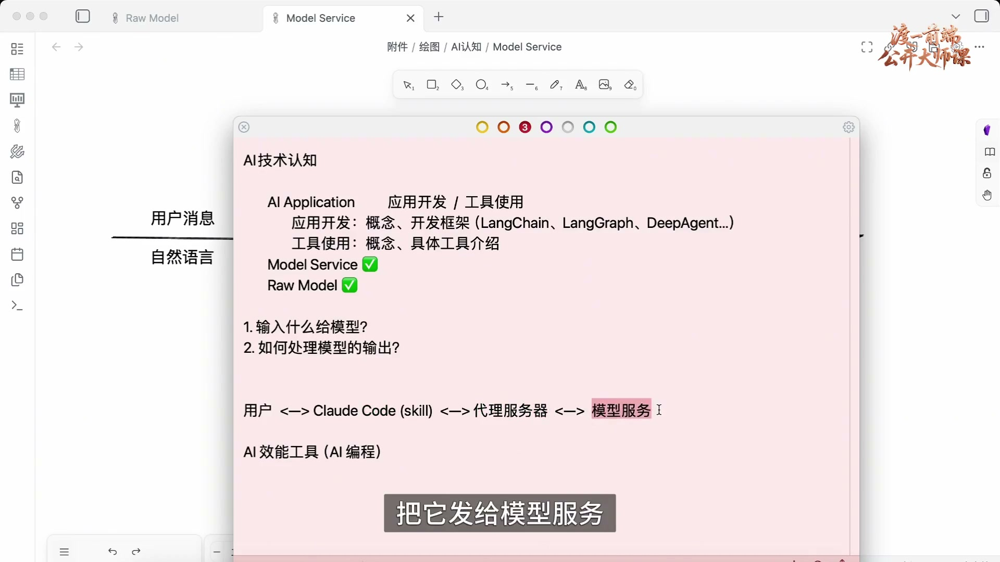

示例采用 Claude Code，也可以换成其他编程工具。正常链路是用户使用编程工具，工具通过 HTTP 请求调用模型服务，再接收结果。

Claude Code 处理模型回复后，将结果呈现给用户。为了分析 Skill 如何参与消息传输，可以抓取 HTTPS 流量，也可以在工具与模型服务之间增加一层代理。本节采用代理方式。

将 Claude Code 的请求地址改为本地代理，由代理转发给模型服务，再将服务响应返回 Claude Code。由于代理由本地控制，可以记录请求和响应，观察实际传输的消息。代理可使用 Node.js 实现。

示例项目名为 proxy-server，核心是一个 JavaScript 文件：启动服务器，接收请求并转发。也可以根据这一需求使用 AI 辅助编写代理代码。

## 11. 配置 .env，用 curl 验证代理日志

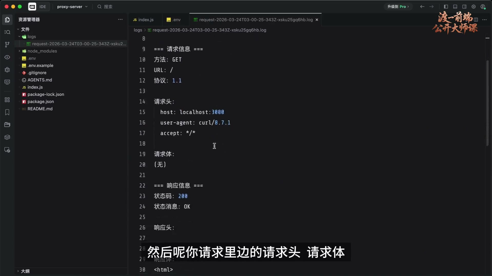

运行 npm run dev 启动代理，示例监听 3000 端口。项目的 .env 未纳入 Git 管理，使用前应将 .env.example 复制为 .env，并配置环境变量，包括日志级别和服务端口。

还需要设置转发目标地址。原课先以百度作为连通性测试目标，再通过 curl 向 http://localhost:3000 发送请求，确认代理能够返回响应。

代理收到请求后，会记录转发目标、请求头、请求体、响应头和响应体，便于观察消息内容。完成代理连通性测试后，再配置 AI 编程工具使用它。

## 12. 让 Claude Code 通过代理访问模型

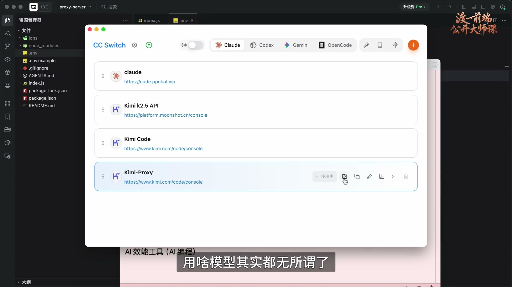

将 AI 编程工具的模型服务地址配置为本地代理地址，才能观察其请求。具体配置方式取决于工具，应查阅相应文档。

示例通过 CC Switch 为 Claude Code 启用 Kimi-Proxy：Claude Code 请求本地代理，代理再转发到 Kimi。这里使用的是 Kimi 模型。

编辑请求地址，使其指向代理服务器，保留其他必要配置，然后启用该配置。CC Switch 会生成相应的工具配置，使后续请求经过代理。

将代理的转发目标从测试用的百度改为 Kimi，并重新启动代理。随后在工程目录中启动 Claude Code，代理日志便会记录工具发送的请求。

## 13. 还没输入问题，应用已经发送了工具描述

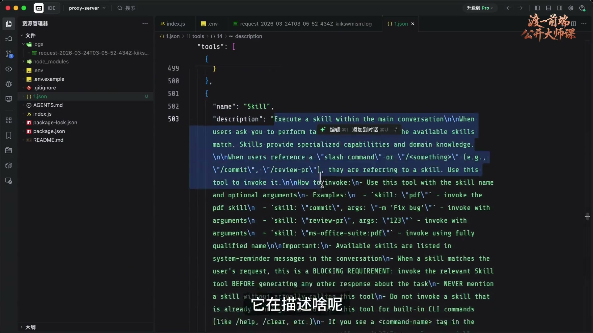

启动后，日志中已经出现 Claude Code 发往模型的请求，包括地址、请求头和 JSON 请求体。此时用户尚未在对话框中输入消息。

这表明 AI 应用可以主动封装并发送消息，而不只是转发用户输入。示例请求中包含一段用于测试模型连通性的用户消息。将请求体整理为 JSON 后，可以进一步检查其结构。

请求还包含 tools，其中有名为 Skill 的工具。它向模型描述技能的含义，以及使用技能时需要返回的信息，例如技能名称。

## 14. “你是谁”的答案，来自应用添加的提示词

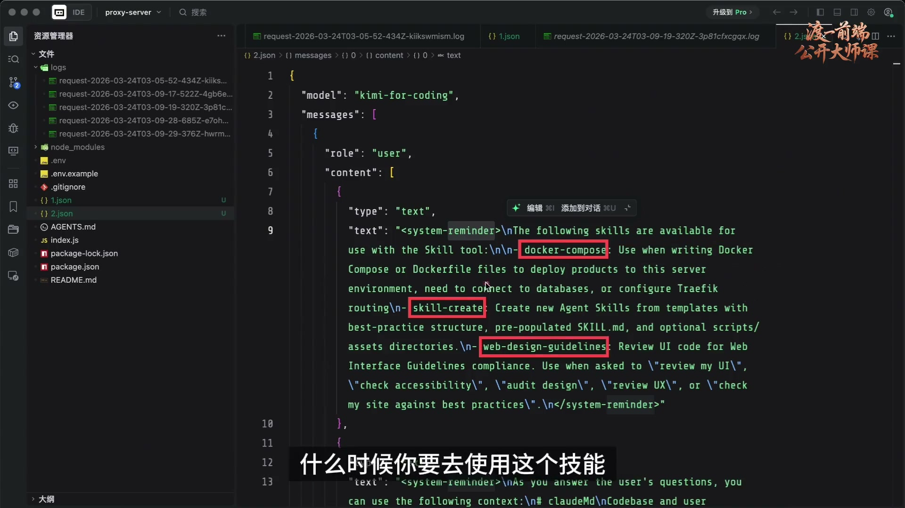

工具描述还约定了参数的传递方式。随后输入“你是谁”，模型回复自己是 Claude Code，一个 CLI 工具。需要结合完整请求分析这一身份描述的来源。

实际调用的是 Kimi 模型，但回复使用了 Claude Code 的身份。检查请求体可以发现，模型收到的不只有“你是谁”，还有应用添加的其他消息。

请求中包含工程的 CLAUDE.md 内容，例如项目规范；还包含 Claude Code 添加的 system-reminder 系统提醒。示例通过对照本地文件与请求日志确认这些内容进入了上下文。

系统提醒列出了可用技能，例如 docker-compose、skill-create 和 web-design-guidelines，并附上各技能的描述，说明适用场景。技能清单以提示词的形式传给模型。

如何发起技能调用，已经在工具描述中约定。系统提示词还指定了“可交互的 CLI 工具”等身份信息，因此“你是谁”的回答来自应用提供的上下文。

## 15. 触发一次技能，再去查真实请求

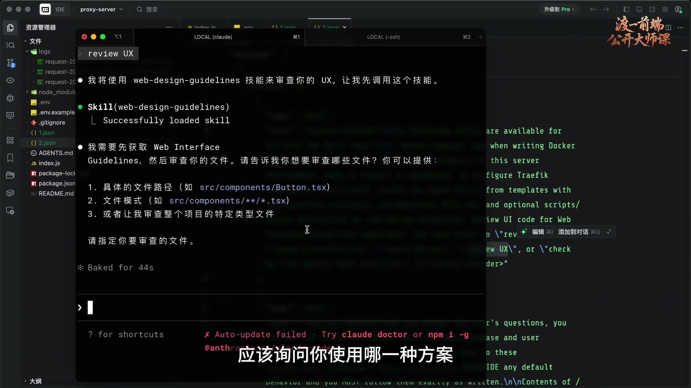

前面的检查展示了应用如何组织模型输入。接下来触发一次技能调用，观察应用如何处理模型输出。

示例输入 review UX，触发 web-design-guidelines。工具显示技能已加载，并根据技能文档询问采用哪种方案。此时可以暂不选择，先检查这轮请求。

模型此前已收到技能清单、描述和调用约定，因此可以根据 review UX 判断是否使用相应技能。在响应日志中搜索 design，可以定位相关回复。

## 16. SSE 流里的自然语言与工具调用 JSON

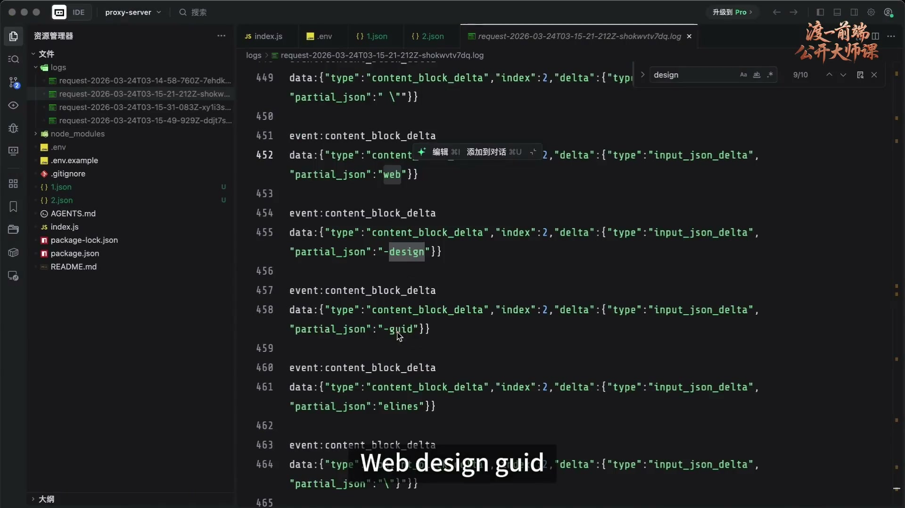

响应采用 SSE 流式传输，内容按片段到达。前面的自然语言片段表示将使用 web-design-guidelines；真正发起技能调用，还需要返回约定的结构化数据。

自然语言回复之后，响应中出现 tool_use，表示使用工具。这部分包含技能调用所需的 JSON 信息。

因为是流式传输，JSON 可能分散在多个片段中。拼接后可以识别 Skill 工具及 web-design-guidelines 技能名称，Claude Code 据此处理调用请求。

## 17. 第一轮：封装输入，模型决定是否调用技能

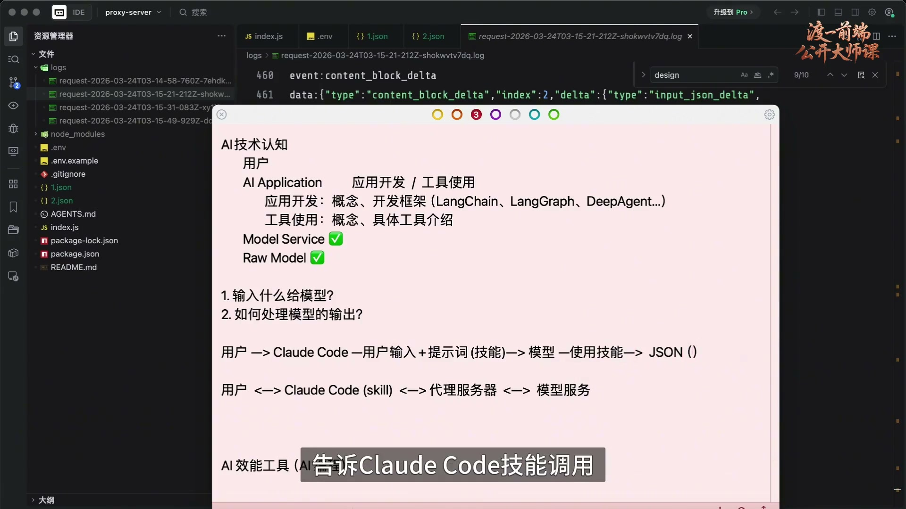

第一轮流程是：用户输入发送给 Claude Code，应用加入系统提示词、技能清单及调用约定，再将完整输入传给模型。

模型根据用户输入与附加上下文判断是否使用技能。例如“你是谁”与技能无关时，可以直接生成普通回复。

需要使用技能时，模型返回结构化的调用信息，告诉 Claude Code 要使用哪个技能，例如 web-design-guidelines。应用收到这类响应后，继续执行本地操作。

## 18. 第二轮：读取技能全文，继续调用模型

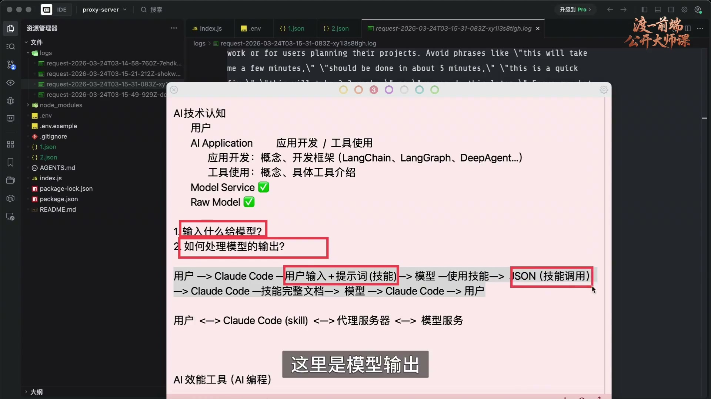

Claude Code 作为本地程序，可以读取技能文档。验证时，可从本地 web-design-guidelines 文档复制一句具有辨识度的文本，再到请求日志中搜索。

可以在后续请求中找到技能全文。初始请求只提供技能清单与描述，确定使用某个技能后，Claude Code 才读取完整文档，并将其内容传给模型。

模型收到技能全文后继续处理，结果再次返回 Claude Code，最终呈现给用户。应用在这一过程中既组织了新输入，也处理了前一轮输出。

整个过程形成多轮交互：模型输出调用信息，应用读取文档，再调用模型，最后返回结果。通过代理日志，可以核对每一轮输入、输出和后续动作。

## 19. 把观察方法迁移到下一个新概念

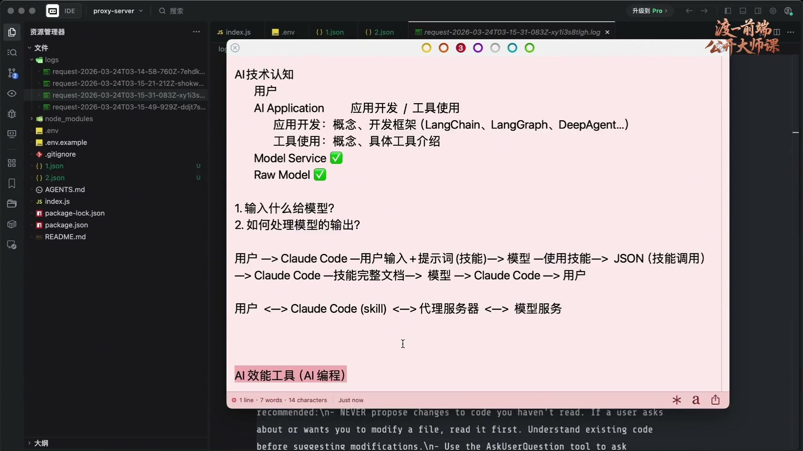

Skill 在本节中用于说明一种可迁移的观察方法。面对 OpenClaw〔名称校读存疑〕或其他新概念，可以同样检查模型输入、输出及应用处理流程，而不依赖工具的热度或生命周期。

本节以模型输入输出为基础，说明模型服务和应用如何在其上组织功能。理解这一结构后，可以用同一套问题分析更多概念。

具体学习某个概念时，再补充其消息格式、后续操作和与其他机制的区别。先把握核心流程，再按需研究实现细节。

## 20. 抓住核心与学习路线

技术概念会持续变化，学习时应先抓住核心结构，再判断新概念解决的问题，避免被大量名称分散注意力。

AI 应用开发与 AI 工具使用是两条不同的学习路线：前者关注如何构建应用，后者关注如何在业务工作中使用已有应用。

开发效能工具可以服务于团队效率与成本管理；使用效能工具则着重改善具体工作流程。两者都可以通过输入、输出与后续处理来理解。
